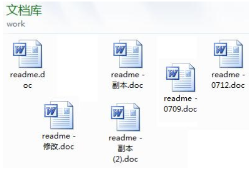
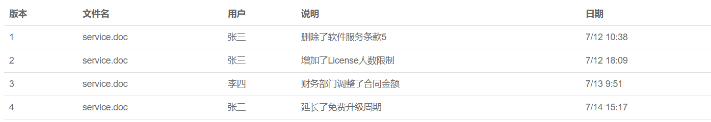

# 关于Git的使用说明
[](http://192.168.0.147:3000/test/FirstTestRepos/src/master/help-gogs.pdf) [](https://git-scm.com/book/zh/v2)
> 在使用Git进行版本控制之前你需要先了解一下基础的Git相关的语法，当然
你也可以先尝试快速入门，有兴趣的话可以clone此项目参与到说明文档的
编写中，也可以把你的问题投稿给我，我会第一时间处理并发布更新。详
情可以查看这个<strong>[帮助文档pdf版](http://192.168.0.147:3000/test/FirstTestRepos/src/master/help-gogs.pdf)</strong>，这篇帮助文档只是作为一个快速入门的指导，
关于更加详细的Git使用方法可以参考<strong>[Git官网帮助文档](https://git-scm.com/book/zh/v2)<strong>，而且基本可以解决
你使用过程中出现的所有问题。

## 使用之前
### 了解Git
> Git是什么？ Git能干什么？

这里我引用别人的一篇文章里的介绍，想了解更多git的使用可访问<strong>[原文网址](https://www.liaoxuefeng.com/wiki/0013739516305929606dd18361248578c67b8067c8c017b000/001373962845513aefd77a99f4145f0a2c7a7ca057e7570000)<strong>
>> Git是什么？<br/>
Git是目前世界上最先进的分布式版本控制系统（没有之一）。<br/>
Git有什么特点？简单来说就是：高端大气上档次！<br/>
那什么是版本控制系统？<br/>
如果你用Microsoft Word写过长篇大论，那你一定有这样的经历：<br/>
想删除一个段落，又怕将来想恢复找不回来怎么办？有办法，先把当前文件“另存为……”
一个新的Word文件，再接着改，改到一定程度，再“另存为……”一个新文件，这样一直改
下去，最后你的Word文档变成了这样：<br/>


>> 过了一周，你想找回被删除的文字，但是已经记不清删除前保存在哪个文件里了，只好
一个一个文件去找，真麻烦。看着一堆乱七八糟的文件，想保留最新的一个，然后把其
他的删掉，又怕哪天会用上，还不敢删，真郁闷。更要命的是，有些部分需要你的财务
同事帮助填写，于是你把文件Copy到U盘里给她（也可能通过Email发送一份给她），
然后，你继续修改Word文件。一天后，同事再把Word文件传给你，此时，你必须想想，
发给她之后到你收到她的文件期间，你作了哪些改动，得把你的改动和她的部分合并，
真困难。于是你想，如果有一个软件，不但能自动帮我记录每次文件的改动，还可以让
同事协作编辑，这样就不用自己管理一堆类似的文件了，也不需要把文件传来传去。如
果想查看某次改动，只需要在软件里瞄一眼就可以，岂不是很方便？
> 这个软件用起来就应该像这个样子，能记录每次文件的改动：<br/>


>> 这样，你就结束了手动管理多个“版本”的史前时代，进入到版本控制的21世纪。

## Git使用相关文章整理
> 整理了一些关于Git使用的不错的文章，希望能够给你们使用git带来方便，少走弯路

### Git入门
* **[图解Git](http://marklodato.github.io/visual-git-guide/index-zh-cn.html)**
* **[搬进 Github](http://gitbeijing.com/)**

### Git合并时候冲突处理
* **[使用git时候的冲突](https://lrita.github.io/2017/05/14/use-meld-as-git-tool/?hmsr=toutiao.io&utm_medium=toutiao.io&utm_source=toutiao.io)**
* **[冲突合并工具Meld](http://meldmerge.org/)**

## Git的分支
> Git的一个强大之处就是它的分支管理，十分的方便

首先看下面的这张图很好的诠释了分支的概念
## 关于.gitignore
> **GitHub上各种项目的[.gitignore](https://github.com/RechoLee/gitignore)只需要复制到你的项目中即可**

### 源起
在使用git这个多人协作的代码版本控制工具时，为了避免每次提交修改代码时，一些预期外的无用文件的改动同时被提交并加入版本控制，需要将一些和代码无关的无用文件排除在版本控制外，此时也就需要使用.gitignore文件来指定这些需要忽略的文件信息。

不同类型的工程都有一些通用的.gitignore范本，一般在项目初始化以后，直接按照范本加入.gitignore文件即可，这些使用.gitignore文件指定的忽略文件是不会被推送到远程仓库的，在以后的coding中就不用再关心这些被忽略的文件了。
### 问题
> .gitignore不起作用

#### case
1. 之前配置过.gitignore文件了，又另外追加别的忽略文件
2. 之前未加入.gitignore文件，现在又想追加一个

**上面的情况下.gitignore文件会不起作用**
### 解决办法
##### 原因:
这是由于.gitignore只能忽略那些原来没有被track的文件，如果某些文件已经被纳入了版本管理中，则修改.gitignore是无效的

##### 处理:
先把本地缓存删除（改变成未track状态），然后再提交
``` git
git rm -r --cached .
git add .
git commit -m 'update gitignore'
```